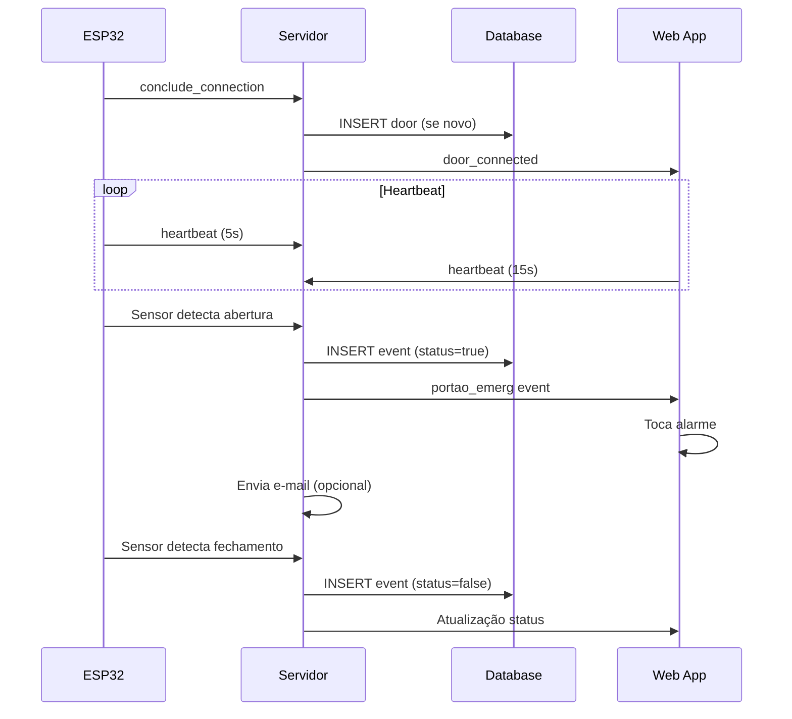

# 🚪 Projeto de Monitoramento de Portões de Emergência


## 📋 Descrição

Sistema completo de monitoramento em tempo real para portões de emergência, composto por dispositivos IoT (ESP32), servidor backend Node.js e aplicação web Vue.js. O sistema registra aberturas, mantém histórico no banco de dados PostgreSQL, notifica usuários via e-mail e exibe atualizações em tempo real através de WebSockets.

O projeto garante segurança e compliance ao fornecer monitoramento contínuo, alertas automáticos e relatórios detalhados sobre o uso dos portões de emergência.

## ✨ Funcionalidades Principais

- **Monitoramento em Tempo Real**: Comunicação bidirecional via Socket.IO entre dispositivos e aplicação web
- **Sistema de Heartbeat**: Detecção automática de dispositivos offline/online
- **Modo Offline**: Armazenamento local de eventos quando sem conexão, com sincronização automática
- **Alertas Inteligentes**: 
  - Alarme sonoro na aplicação web
  - Sirene física no dispositivo
  - Notificações por e-mail
- **Histórico Completo**: Registro de todas as aberturas com timestamp
- **Interface Responsiva**: Dashboard adaptável para desktop e mobile
- **Multi-Portão**: Suporte para múltiplos portões simultaneamente
- **Status Visual**: Indicadores de estado (aberto/fechado/desconectado)

## 🏗️ Arquitetura do Sistema

```
┌─────────────────┐         ┌──────────────────┐         ┌─────────────────┐
│  Dispositivo    │◄───────►│   Servidor       │◄───────►│   Front-end     │
│  ESP32          │         │   Node.js        │         │   Vue.js        │
│                 │         │                  │         │                 │
│ • Sensor        │         │ • Socket.IO      │         │ • Dashboard     │
│ • RTC DS3231    │         │ • Express        │         │ • Vuetify       │
│ • WiFi          │         │ • PostgreSQL     │         │ • Socket.IO     │
│ • Sirene        │         │ • NodeMailer     │         │ • Alertas       │
└─────────────────┘         └──────────────────┘         └─────────────────┘
        │                            │                            │
        └────────────────────────────┴────────────────────────────┘
                         Socket.IO + HTTP
```

## 🔧 Componentes do Sistema

### Hardware (Dispositivo ESP32)

- **Microcontrolador**: ESP32 DevKit
- **RTC**: Módulo DS3231 (clock em tempo real)
- **Sensor**: Relé/Switch de porta (GPIO16)
- **Sirene**: Buzzer/Sirene (GPIO17)
- **Comunicação**: WiFi 2.4GHz
- **Protocolo**: Socket.IO (Engine.IO v4) + HTTP

### Software Backend (Servidor Node.js)

- **Runtime**: Node.js
- **Framework**: Express.js
- **WebSocket**: Socket.IO
- **Banco de Dados**: PostgreSQL
- **E-mail**: NodeMailer (SMTP Gmail)
- **Porta**: 3028

### Software Frontend (Aplicação Vue.js)

- **Framework**: Vue.js 3 (Composition API)
- **UI Library**: Vuetify 3
- **Cliente WebSocket**: Socket.IO Client
- **Estilo**: CSS3 com animações
- **Recursos**: Alertas sonoros, indicadores visuais

## 📦 Estrutura do Projeto

```
emergency-gate-monitoring/
├── src/
│   └── main.cpp              # Firmware ESP32 (PlatformIO)
├── test/
│   └── doorRepository.js     # Repositório de dados (PostgreSQL)
├── platformio.ini            # Configurações PlatformIO
├── images/                   # Screenshots da aplicação
└── README.MD

Arquivos Relacionados (Repositórios Externos):
├── portao_emerg.js          # Servidor Socket.IO/Express
├── PortaoEmergencia.vue     # Componente Vue.js Frontend
└── mailer.js                # Configuração de e-mail
```

## 🚀 Instalação e Configuração

### 1️⃣ Banco de Dados PostgreSQL

```sql
-- Criar schema
CREATE SCHEMA IF NOT EXISTS portoes;

-- Tabela de portões registrados
CREATE TABLE portoes.portoes_emerg_registrados (
    door_id VARCHAR(10) PRIMARY KEY,
    name VARCHAR(100) NOT NULL
);

-- Tabela de eventos/histórico
CREATE TABLE portoes.portoes_emergencia (
    id SERIAL PRIMARY KEY,
    portao VARCHAR(10) REFERENCES portoes.portoes_emerg_registrados(door_id),
    status BOOLEAN NOT NULL,
    date TIMESTAMP NOT NULL DEFAULT NOW()
);

-- Índices para performance
CREATE INDEX idx_portoes_date ON portoes.portoes_emergencia(date DESC);
CREATE INDEX idx_portoes_status ON portoes.portoes_emergencia(portao, status);
```

### 2️⃣ Servidor Backend (Node.js)

```bash
# Instalar dependências
npm install express socket.io cors pg nodemailer

# Criar arquivo .env
cat > .env << EOF
# Banco de Dados PostgreSQL
IP=localhost
PORT=5432
USERS=postgres
PASS=sua_senha
DBASE=nome_database

# Configuração de E-mail
EMAIL=seu_email@gmail.com
EMAIL_PASS=senha_app_gmail
EOF

# Iniciar servidor
node portao_emerg.js
```

**Dependências principais:**
- `express`: ^4.18.0
- `socket.io`: ^4.6.0
- `pg`: ^8.11.0
- `nodemailer`: ^6.9.0
- `cors`: ^2.8.5

### 3️⃣ Dispositivo ESP32 (Firmware)

**Usando PlatformIO:**

```bash
# Instalar PlatformIO CLI
pip install platformio

# Navegar até o diretório do projeto
cd emergency-gate-monitoring

# Compilar
pio run

# Fazer upload para ESP32
pio run --target upload

# Monitorar Serial
pio device monitor -b 115200
```

**Configurações no `src/main.cpp`:**

```cpp
// WiFi
const char *ssid = "SUA_REDE_WIFI";
const char *password = "SUA_SENHA_WIFI";

// Servidor
#define URL_LINK "http://IP_SERVIDOR:3028/portao_emerg"
const char *websockets_server = "IP_SERVIDOR";
const uint16_t websockets_server_port = 3028;

// Identificação do Portão
const char *door_id = "1";  // ID único do portão
const char *name = "Portão Emergência 1";  // Nome descritivo
```

**Bibliotecas necessárias** (gerenciadas pelo PlatformIO):
- `ArduinoJson` (^7.4.2)
- `RTClib` (^2.1.4)
- `WebSockets` (^2.3.0)
- `ArduinoHttpClient` (^0.6.1)

### 4️⃣ Frontend (Vue.js)

```bash
# Em um projeto Vue.js existente, instalar dependências
npm install socket.io-client

# Configurar IP do servidor em @/ip.js
echo "export default 'IP_SERVIDOR'" > src/ip.js

# Copiar componente PortaoEmergencia.vue para src/views/
# Adicionar rota no router
```

**Configuração de rota (router/index.js):**

```javascript
{
  path: '/portoes-emergencia',
  name: 'PortaoEmergencia',
  component: () => import('@/views/PortaoEmergencia.vue')
}
```

## 🔌 Conexões do Hardware

### Pinagem ESP32

| Componente | Pino ESP32 | GPIO | Função |
|------------|-----------|------|--------|
| Sensor/Relé | 16 | GPIO16 | INPUT_PULLUP |
| Sirene | 17 | GPIO17 | OUTPUT |
| RTC SDA | 21 | GPIO21 | I2C Data |
| RTC SCL | 22 | GPIO22 | I2C Clock |
| RTC VCC | 3.3V | - | Alimentação |
| RTC GND | GND | - | Terra |

### Diagrama de Conexão

```
         ESP32                    RTC DS3231
    ┌─────────────┐          ┌──────────────┐
    │             │          │              │
    │  GPIO21 ────┼──────────┤ SDA          │
    │  GPIO22 ────┼──────────┤ SCL          │
    │  3.3V   ────┼──────────┤ VCC          │
    │  GND    ────┼──────────┤ GND          │
    │             │          └──────────────┘
    │  GPIO16 ────┼──── Sensor de Porta
    │  GPIO17 ────┼──── Sirene
    └─────────────┘
```

## 📡 Protocolo de Comunicação

### Eventos Socket.IO (Dispositivo → Servidor)

| Evento | Direção | Payload | Descrição |
|--------|---------|---------|-----------|
| `conclude_connection` | ESP32→Server | `{door, name, status}` | Handshake inicial |
| `heartbeat` | ESP32→Server | `{door_id: timestamp}` | Keep-alive (5s) |
| `door_status` | ESP32→Server | `{door, status}` | Resposta de status |

### Eventos Socket.IO (Servidor → Dispositivo)

| Evento | Direção | Payload | Descrição |
|--------|---------|---------|-----------|
| `start_conclude_connection` | Server→ESP32 | - | Inicia handshake |
| `get_door_status` | Server→ESP32 | `{door}` | Requisita status |
| `conclude_ack` | Server→ESP32 | `{door}` | Confirma conexão |

### Eventos Socket.IO (Aplicação Web)

| Evento | Direção | Payload | Descrição |
|--------|---------|---------|-----------|
| `get_all_doors` | Client→Server | - | Lista todos portões |
| `get_connected_doors` | Client→Server | - | Lista portões online |
| `last_openings` | Client→Server | `{door, limit}` | Histórico |
| `portao_emerg` | Server→Client | `{door, status, date}` | Atualização em tempo real |
| `door_connected` | Server→Client | `{door, name, status}` | Novo portão online |
| `door_disconnect` | Server→Client | `{door, alive, timestamp}` | Portão offline |

### Endpoint HTTP

```
POST /portao_emerg
Content-Type: application/json

{
  "open": true,
  "door": "1",
  "offline_mode": false,
  "offline_openings": ["dd/MM/yyyy HH:mm:ss", ...]
}
```

## 🔍 Funcionalidades Detalhadas

### Sistema de Heartbeat

**Dispositivo ESP32:**
- Envia heartbeat a cada 5 segundos
- TTL: 10 segundos (2x intervalo)
- Marca automaticamente como offline se não responder

**Aplicação Web:**
- Envia heartbeat a cada 15 segundos
- Verifica conexão do servidor
- Exibe aviso se desconectado

### Modo Offline (ESP32)

Quando sem conexão WiFi ou servidor inacessível:
1. Eventos são armazenados em buffer local (20 posições)
2. Timestamp obtido do RTC DS3231
3. Ao reconectar, sincroniza automaticamente via HTTP POST
4. Buffer é limpo após envio bem-sucedido

### Alertas e Notificações

**Quando portão abre:**
1. ✅ ESP32 aciona sirene física
2. ✅ Servidor registra no banco de dados
3. ✅ Servidor envia evento Socket.IO
4. ✅ Aplicação web toca alarme sonoro
5. ✅ Servidor envia e-mail (opcional/comentado)

**Quando portão fecha:**
1. ✅ ESP32 desliga sirene
2. ✅ Servidor registra fechamento
3. ✅ Aplicação atualiza status visual

## 🎨 Interface do Usuário

### Tela Inicial
- Botão para iniciar monitoramento
- Conecta ao servidor Socket.IO

### Dashboard de Monitoramento
- **Cards de Portão**: Um para cada portão registrado
  - Cor verde: Fechado
  - Cor vermelha (pulsante): Aberto
  - Cor cinza: Desconectado
- **Informações por card**:
  - Nome do portão
  - Status atual
  - Última atualização
  - Últimas 5 aberturas (expandível)
  - Ícone de conexão

### Estados Visuais
```css
.door-card.open      → Vermelho + animação pulse
.door-card.close     → Verde
.door-card.disconnected → Cinza + borda tracejada
```

## 🛡️ Segurança e Confiabilidade

- ✅ Reconexão automática de WebSocket
- ✅ Detecção de dispositivos offline
- ✅ Buffer de eventos offline
- ✅ Validação de IDs de portão
- ✅ Debounce de sensor (50ms)
- ✅ Timestamp sincronizado (RTC)
- ✅ Tratamento de erros HTTP/Socket
- ✅ Pooling de conexões PostgreSQL

## 📊 Monitoramento e Logs

### Logs do Servidor
```
[Sistema] Porta conectada: Portão 1
[WS] Heartbeat check - doors connected: 3
[HTTP] Dados recebidos do portão: {door: "1", status: true}
[WS] Porta desconectada: Portão 2
```

### Logs do Dispositivo
```
[WiFi] Conectado com sucesso
[WS] Conectado
[WS] conclude_connection enviado
[Porta] Aberta, enviando
[WS] Heartbeat enviado
```

## 🐛 Troubleshooting

### Dispositivo não conecta

```bash
# Verificar WiFi
# No Serial Monitor, verificar se conectou com sucesso

# Verificar servidor
curl http://IP_SERVIDOR:3028/

# Verificar firewall
sudo ufw allow 3028
```

### Aplicação não recebe atualizações

```javascript
// Verificar IP do servidor em @/ip.js
// Conferir porta 3028 acessível
// Verificar console do navegador para erros Socket.IO
```

### Banco de dados não registra

```sql
-- Verificar conexão
SELECT * FROM portoes.portoes_emerg_registrados;

-- Verificar últimos eventos
SELECT * FROM portoes.portoes_emergencia ORDER BY date DESC LIMIT 10;
```

## 🔄 Fluxo de Funcionamento



## 📈 Melhorias Futuras

- [ ] Dashboard de estatísticas e gráficos
- [ ] Exportação de relatórios (PDF/Excel)
- [ ] Autenticação de usuários
- [ ] Configuração de alertas personalizados
- [ ] Suporte MQTT como alternativa
- [ ] App mobile nativo
- [ ] Integração com sistemas de segurança
- [ ] Backup automático de dados


## 👥 Contribuidores

Desenvolvido para sistema de monitoramento de segurança empresarial.

---

**Status do Projeto**: ✅ Em Produção  
**Última Atualização**: Novembro 2025
